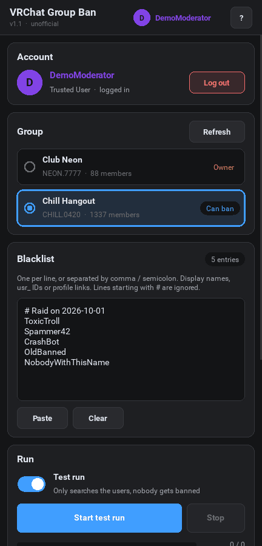
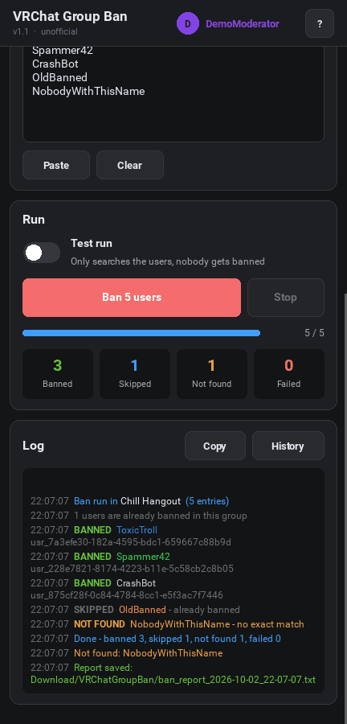
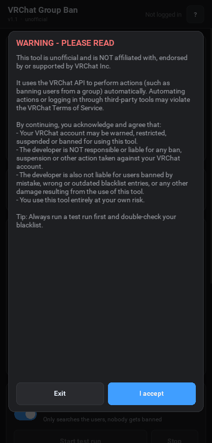
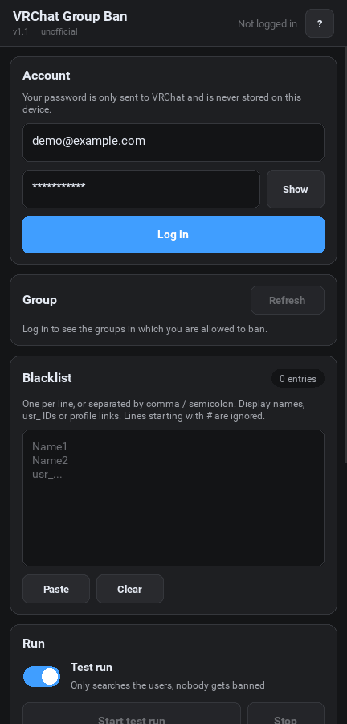
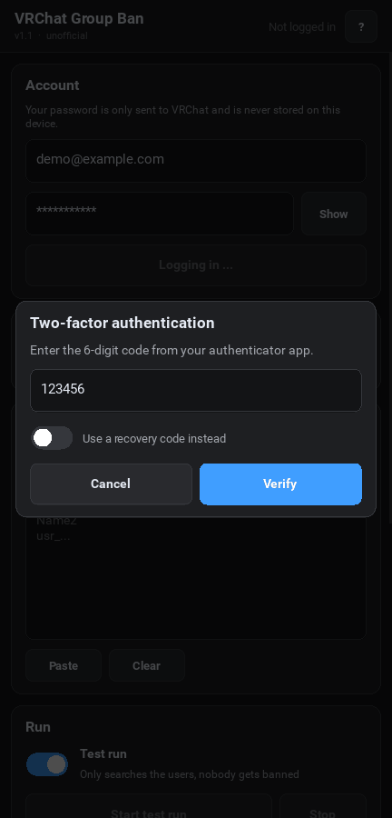
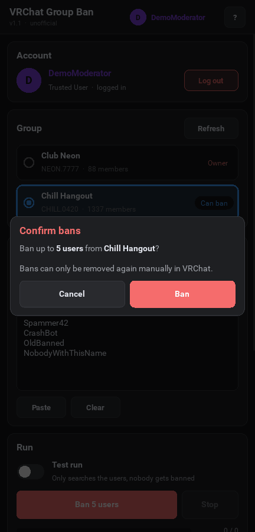
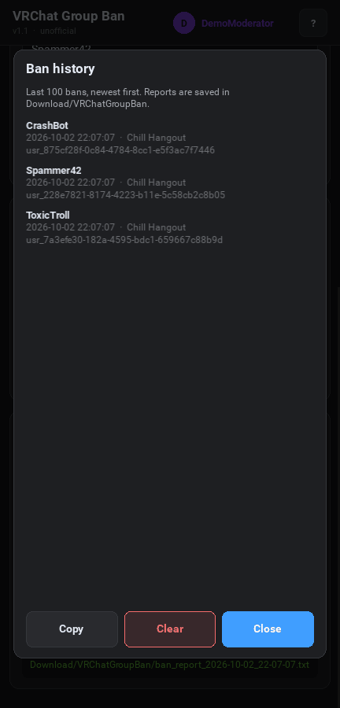

# VRChat Group Ban

An Android app that bans a whole list of users from a VRChat group in one go, for example after a raid. You enter a blacklist and pick your group, and the app works through the list for you.

<p align="center">
  
  &nbsp;
  
</p>

> [!WARNING]
> This tool is **unofficial** and not affiliated with, endorsed or supported by VRChat Inc.
> Automating actions through third-party tools may violate the VRChat Terms of Service. Your account could be warned, restricted or banned. **Use it at your own risk** and always start with a test run.

## Features

- **Only your groups.** After you log in, the app loads your groups and lists only those in which you are allowed to ban (owner, or a role with the *Manage Group Bans* permission).
- **Bulk bans.** Paste display names, `usr_` IDs or profile links. Separate them with a new line, comma or semicolon.
- **Test run.** Search every user first and see who *would* be banned, without banning anyone.
- **Smart skipping.** Users that are already banned, duplicates and your own account are skipped automatically.
- **Live progress.** A progress bar, counters (banned / skipped / not found / failed) and a colored log.
- **Report and history.** Every real run saves a report to `Download/VRChatGroupBan/`, and the app keeps a history of your last bans.
- **2FA support.** Authenticator app, email code and recovery codes all work.
- **Safe to use.** Your password is never stored. Bans need an extra confirmation, and the back button will not kill a running ban run.

## Download and install

1. Open the [**Actions**](../../actions) tab and click the newest successful **Build APK** run.
2. At the bottom, under **Artifacts**, download **`vrchat-group-ban-apk`**. It is a ZIP file.
3. Unzip it and copy the `.apk` file to your phone.
4. Open the APK on your phone. Android will ask you to allow installing apps from this source.

> [!NOTE]
> The builds are debug builds, and each one is signed with a new key. To update, **uninstall the old version first**, otherwise Android shows "App not installed". This also deletes the ban history of the old version. Copy it first if you need it (**History → Copy**).

Requires Android 7.0 or newer.

## How to use it

### 1. Accept the warning

On the first start (and after each update) the app shows a warning about the VRChat Terms of Service. Tap **I accept** to continue or **Exit** to close the app. You can read it again at any time with the **?** button in the top right.



### 2. Log in

Enter your VRChat username (or email) and password and tap **Log in**.

If your account uses two-factor authentication, enter the 6-digit code from your authenticator app or from the email VRChat sent you. If you lost access to your authenticator, switch on **Use a recovery code instead**. If you type a wrong code, you can simply try again.

<p>
  
  &nbsp;
  
</p>

Your password is only sent to VRChat and is never saved. Only your username is remembered for the next start.

### 3. Pick a group

After the login the app loads your groups automatically and shows **only the groups in which you can ban**:

- **Owner**: you own the group.
- **Can ban**: one of your roles has the *Manage Group Bans* permission.

Tap a group to select it. Your choice is remembered. The list is reloaded once a day. Tap **Refresh** if you just got new permissions or joined a new group.

If no group shows up, you don't have ban permissions in any of your groups.

### 4. Fill in the blacklist

Put one user per line, or separate them with commas or semicolons. You can mix:

| Entry | Example |
| --- | --- |
| Display name | `ToxicTroll` |
| User ID | `usr_7a3efe30-182a-4595-bdc1-659667c88b9d` |
| Profile link | `https://vrchat.com/home/user/usr_7a3efe30-...` |
| Comment (ignored) | `# Raid on 2026-10-01` |

Display names must match **exactly** (upper and lower case don't matter). Names that VRChat can't find are listed as *Not found* and nobody else gets banned in their place. **Paste** adds the clipboard to the list and **Clear** empties it. The blacklist is saved for the next start.

### 5. Start a test run

**Test run** is switched on every time you open the app. Tap **Start test run** and the app searches every entry and shows in the log who it *would* ban. Nobody gets banned.

Check the log. If everything looks right, switch **Test run** off. The button turns red and says **Ban X users**.

### 6. Ban

Tap **Ban X users** and confirm. The confirmation names the group so you can't accidentally ban in the wrong one.

<p>
  
  &nbsp;
  
</p>

During the run you can follow everything live:

| Label in the log | Meaning |
| --- | --- |
| **BANNED** | The user was banned. |
| **WOULD BAN** | Test run only: this user would be banned. |
| **SKIPPED** | Already banned, listed twice, or it's you. |
| **NOT FOUND** | No user with exactly this name or ID. |
| **FAILED** | VRChat refused the ban or a network error happened. The reason is in the log. |

You can tap **Stop** at any time. The screen stays on during a run so Android doesn't pause the app. If VRChat limits the request rate, the app waits automatically and continues.

### 7. Report and history

After a real run, the app saves a report as a text file in **`Download/VRChatGroupBan/`** with all banned, skipped, missing and failed entries.

**History** shows your last 100 bans, newest first. **Copy** copies the history and **Clear** deletes it from the app (nobody gets unbanned). **Copy** next to the log copies the complete log, which is handy for asking for help.



## Privacy and security

- The app only talks to the official VRChat API (`api.vrchat.cloud`). There are no other servers, no tracking and no ads.
- Your password and login session are **never saved** to the device. After closing the app, you have to log in again.
- Stored on the device (app-private storage): your username, the blacklist, your group list and selection, and the ban history.
- Only real VRChat IDs are accepted, so no manipulated input can end up in an API request.
- The only Android permission is **Internet**.

## Troubleshooting

| Problem | Solution |
| --- | --- |
| "App not installed" during an update | Uninstall the old version first (see [Download and install](#download-and-install)). |
| "Wrong username or password" | Check your login data. You can test it on [vrchat.com](https://vrchat.com/home/login). |
| "Too many login attempts" | VRChat temporarily blocks repeated logins. Wait a few minutes. |
| My group is missing | You need the *Manage Group Bans* permission in that group. Tap **Refresh** after you got it. |
| A user is *Not found* | The display name must match exactly. Use the `usr_` ID or the profile link instead. |
| "Session expired" | Log in again. Your blacklist and group selection are kept. |

## Building it yourself

The APK is built automatically with GitHub Actions ([`.github/workflows/build.yml`](.github/workflows/build.yml)) on every push to `main`, using [Buildozer](https://github.com/kivy/buildozer) and [Kivy](https://kivy.org/). You can also start a build by hand under **Actions → Build APK → Run workflow**.

To build locally on Linux:

```bash
pip install buildozer "cython<3"
buildozer -v android debug
```

The APK ends up in `bin/`. The app itself is a single file, [`main.py`](main.py). The build settings are in [`buildozer.spec`](buildozer.spec).
